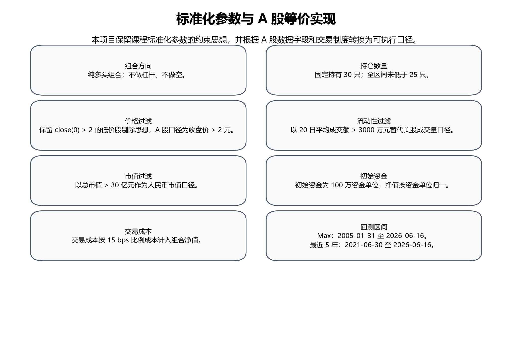
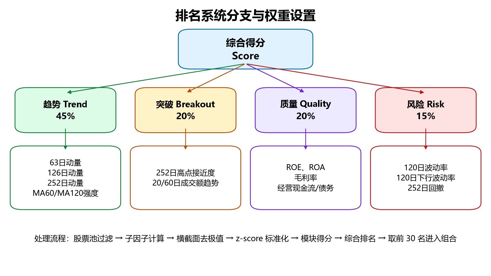
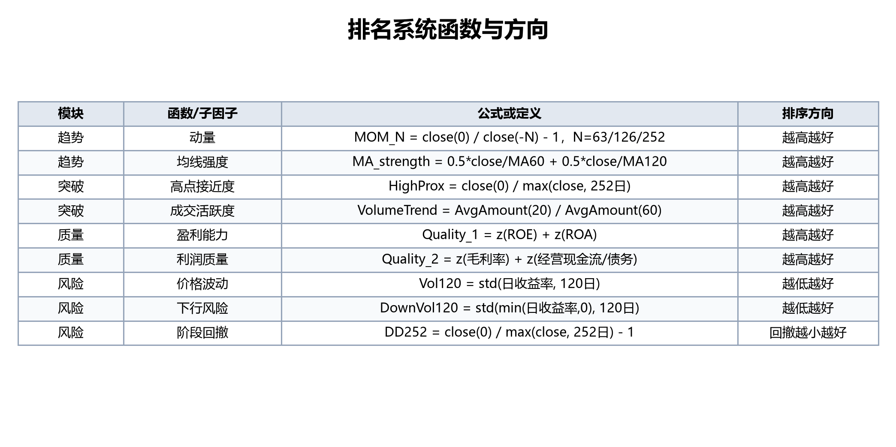
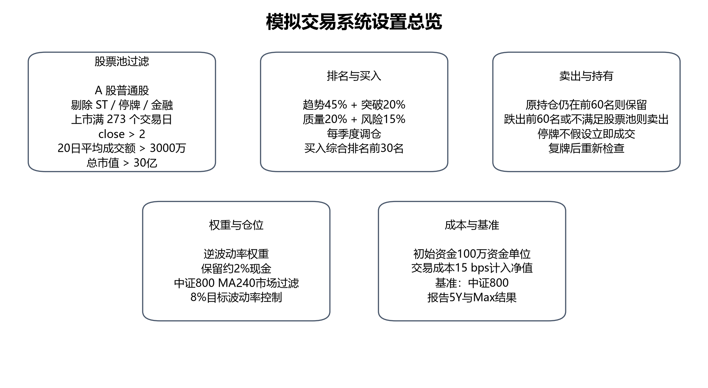
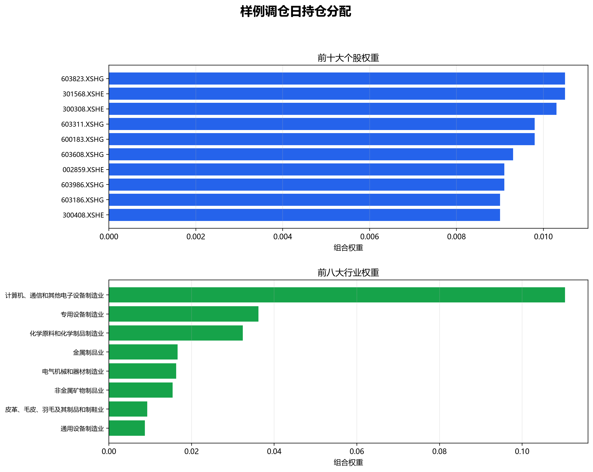
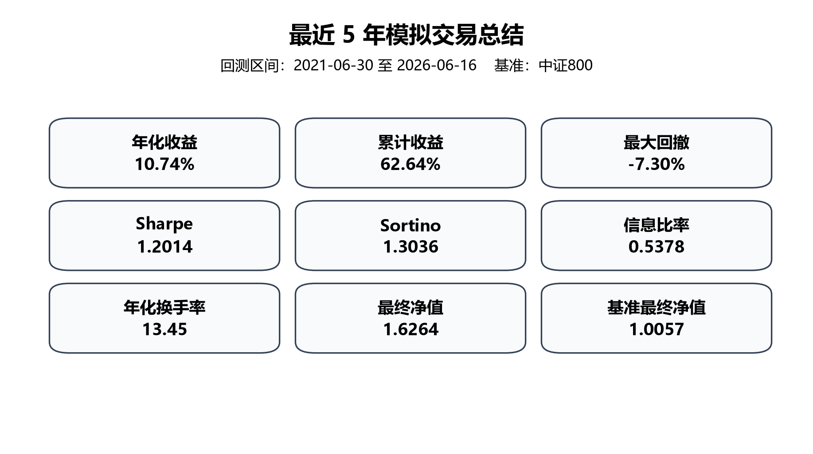
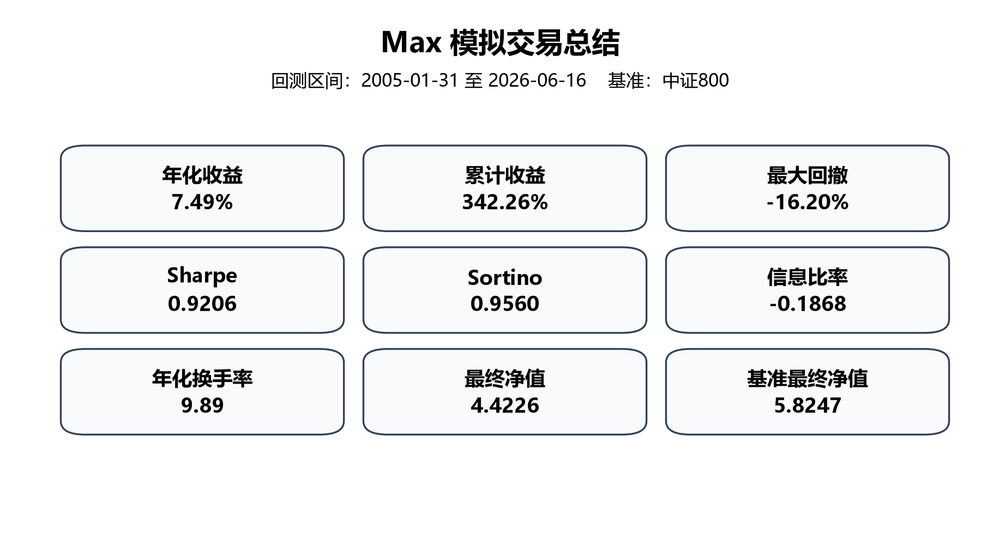

# A 股多因子量化交易系统课程报告

## 1. 摘要

本项目设计并实现了一套面向 A 股市场的多因子纯多头量化交易系统。策略的基本目标不是预测单只股票的短期涨跌，而是在每一个调仓时点，从满足流动性和可交易性约束的股票中，选出趋势形态较强、突破状态较好、基本面质量较稳定、风险特征相对可控的一组股票，并通过分散持仓、逆波动率权重、市场状态过滤和目标波动率控制，构建可解释、可复现的组合。

策略运行流程可以概括为四步。第一步，在全 A 股范围内剔除 ST、停牌、金融行业、上市时间不足、价格过低、成交额不足和市值过小的股票，保证候选股票具备基础交易条件。第二步，对候选股票计算趋势、突破、质量和风险四类信号，并经过去极值、标准化和加权汇总得到综合排名。第三步，在季度调仓日买入综合排名靠前的 30 只股票，并对仍处于前 60 名的原持仓设置卖出缓冲，以减少无意义换手。第四步，根据个股波动率、市场指数长期均线和组合目标波动率确定实际股票仓位，使组合在市场波动上升时主动降低风险暴露。

最终策略在最近 5 年区间取得 10.74% 年化收益、62.64% 累计收益、-7.30% 最大回撤和 1.2014 的 Sharpe；同期中证 800 基准累计收益为 0.57%。在 Max 区间，策略取得 7.49% 年化收益、342.26% 累计收益、-16.20% 最大回撤和 0.9206 的 Sharpe；同期基准累计收益为 482.47%。这说明策略在近 5 年表现出较好的风险调整收益，在长样本中没有取得高于基准的最终净值，但回撤控制明显更稳健，整体更接近“低回撤、防守型、强调风险预算”的多因子组合。

本项目的主要局限也需要在摘要中直接说明：Max 区间 Sharpe 未超过 1，说明长周期风险调整收益仍有提升空间；策略在强牛市阶段可能因为市场过滤和目标波动控制而降低进攻性；趋势与突破信号之间存在一定相关性，未来仍需要引入更独立的盈利修正、成长质量或预期变化信号。

| 区间 | 年化收益 | 累计收益 | 最大回撤 | Sharpe | Sortino | 年化换手率 | 最终净值 |
|---|---:|---:|---:|---:|---:|---:|---:|
| 最近 5 年 | 10.74% | 62.64% | -7.30% | 1.2014 | 1.3036 | 13.45 | 1.6264 |
| Max | 7.49% | 342.26% | -16.20% | 0.9206 | 0.9560 | 9.89 | 4.4226 |

表 1  最终策略绩效汇总

## 2. 数据来源与样本说明

本项目使用的数据来源于米筐 RQData / RQAlpha Plus 账号下载的 A 股历史数据，数据类型包括股票日线行情、指数日线行情、交易日历、股票基础信息、ST 与停牌状态、行业分类、财务与估值因子、复权信息、分红信息和无风险利率。上述数据能够覆盖股票池构建、因子计算、交易状态判断、组合净值计算和绩效评估所需的主要信息。

股票日线行情是策略中使用最频繁的数据。收盘价用于计算不同期限动量、均线相对强度、阶段高点接近度、波动率、下行波动率和历史回撤；成交额用于判断流动性是否足够，并用于构造成交活跃度变化指标；复权信息用于保持历史价格序列在分红、送转和拆股之后具有可比性。指数日线行情用于构建中证 800 基准，并计算市场指数相对 MA240 的位置，从而判断组合是否需要降低股票风险暴露。

股票基础信息用于识别普通 A 股、上市日期、行业分类和股票状态。上市日期决定一只股票是否满足 273 个交易日以上的历史长度要求；行业分类用于剔除金融行业并进行后续行业暴露分析；ST 与停牌状态用于排除交易状态异常的标的。财务与估值因子主要用于构建质量模块，包括 ROE、ROA、毛利率和经营现金流/债务等指标。无风险利率用于现金仓位或低风险仓位收益估算，使组合净值计算更接近实际资金管理过程。

课程原始参数主要来自较标准化的股票多因子框架，本项目在 A 股市场中使用等价口径实现。价格过滤保留“剔除低价股”的思想；成交量过滤转换为 20 日平均成交额约束；市值过滤采用人民币总市值口径；交易状态过滤加入 A 股特有的 ST、停牌和上市时间约束。这些转换并不是为了改变策略逻辑，而是为了让原始思想在 A 股市场中具备可交易性和可解释性。

需要强调的是，所有回测和实验均基于同一批历史数据完成，同一策略参数在相同样本下可以复现相同结果。报告正文重点说明数据来源与数据构成，工程层面的缓存路径、校验文件和运行脚本放在项目复现说明中，不作为报告主体内容展开。



图 1  标准化参数与 A 股等价实现

## 3. 策略设计原则

本策略的第一条原则是先保证可交易性，再讨论因子收益。A 股市场中，部分股票会因 ST、停牌、上市时间过短、成交额不足或价格过低而难以真实交易。如果直接在全市场上做因子排序，回测可能会选中实际交易受限的股票，导致收益被不可成交标的放大。因此，策略把股票池过滤放在排名系统之前，先排除明显不适合作为组合成分的股票，再在剩余样本中比较因子得分。

第二条原则是将价格行为与基本面质量结合。仅使用基本面质量指标，容易买入长期低估但价格趋势持续走弱的公司；仅使用趋势或突破指标，又可能在市场情绪高涨时买入基本面薄弱、波动很大的股票。策略将趋势、突破、质量和风险四类模块放入同一排名系统，是为了让不同信息来源互相制约：趋势负责捕捉市场已经确认的强势，突破负责识别阶段性加速，质量负责降低基本面缺陷，风险负责控制高波动和深回撤股票的进入概率。

第三条原则是将组合风险作为显式约束，而不是事后解释。A 股市场存在明显的牛熊切换和风格轮动，如果组合长期满仓并偏向强趋势股票，在熊市或高波动环境中可能出现较大回撤。因此，策略在个股层面使用逆波动率权重，在组合层面使用中证 800 MA240 市场过滤和 8%目标波动率。这样设计的含义是：策略并不只追求持有“排名最高”的股票，还要求这些股票在组合层面形成可承受的风险暴露。

第四条原则是控制信号更新与持有期的节奏。趋势和突破信号并不是日频噪声，它们更适合在一个相对稳定的窗口内观察。如果调仓过于频繁，组合会被短期价格波动和成交扰动反复牵动，导致换手率上升而信号质量下降。季度调仓的意义就在于给信号留出时间，让已经形成的趋势、成交改善和基本面状态有机会在组合层面兑现。

第五条原则是避免用单一指标解释全部结果。多因子策略的表现通常来自多个环节共同作用，包括股票池过滤、排名系统、持仓数量、卖出缓冲、调仓频率、权重规则、市场过滤和交易成本。报告在后文分别展示净值、回撤、年度收益、持仓数量、换手率、成本拖累和敏感性测试，是为了说明策略结果不是由某一个参数偶然造成的，而是由一套完整交易规则共同生成的。

第六条原则是保留参数之间的层次关系。股票池过滤负责排除不能交易的样本；排名系统负责判断谁更强；持仓数量负责控制组合集中度；逆波动率权重负责分配风险预算；市场过滤负责决定系统层面的仓位开关；目标波动率负责决定组合最终的风险预算。这些层次不能混在一起写，否则容易把“选股”和“仓位管理”说成同一个动作，也会让读者误解策略到底是哪一层在起作用。

第七条原则是保留失败或较弱的实验结果。策略迭代过程中，高目标波动率、过宽卖出缓冲和部分短期均线过滤都曾在某些指标上表现更好，但同时带来了更大的 Max 回撤或更差的长期 Sharpe。最终选择 MA240 与 8%目标波动率，是因为这组参数在近 5 年收益、长期回撤和长期 Sharpe 之间更均衡，而不是因为它在所有单项指标上都最高。

## 4. 排名系统

排名系统决定每个调仓日哪些股票进入组合。具体流程是：先对通过股票池过滤的候选股票计算所有子因子；然后对每个子因子做横截面去极值，以降低极端值对排序的影响；再进行 z-score 标准化，使不同单位、不同数量级的指标能够放在同一尺度上比较；最后先合成模块得分，再合成综合得分。对于方向为“越低越好”的风险指标，标准化后会进行方向调整，使所有模块都遵循“得分越高越好”的统一解释。

去极值和标准化不是装饰性的预处理，而是排名系统能否稳定工作的关键。若不去极值，某一只财务口径异常或价格跳变特别大的股票可能会把整个横截面拉歪；若不标准化，像动量、波动率和财务比率这类不同量纲的指标无法直接比较。由于本策略的目标不是估计精确回归系数，而是生成稳定排序，因此横截面标准化比原始数值更重要。

综合排名采用“排名树”结构，而不是把所有子因子简单平均。第一层是四个一级模块：趋势、突破、质量和风险；第二层是各模块内部的子因子；第三层是最终综合分。最终综合分公式如下：

```text
Score = 45% * Trend
      + 20% * Breakout
      + 20% * Quality
      + 15% * Risk
```



图 2  排名系统分支与权重设置

趋势模块权重为 45%，是整个排名系统中权重最高的部分。设置较高趋势权重的原因是，A 股市场中阶段性资金偏好、风格轮动和趋势延续现象较明显，价格趋势往往能够综合反映盈利预期、行业景气、流动性偏好和市场关注度的变化。趋势模块并不只使用单一动量，而是同时使用 63 日、126 日和 252 日动量，以及 60 日和 120 日均线相对强度。这样做可以避免过度依赖某一个时间窗口：63 日动量更偏季度强势，126 日动量反映半年维度趋势，252 日动量反映一年维度的长期趋势，均线相对强度则用于判断当前价格是否仍处于中期趋势之上。

从经济含义上看，动量并不是“追涨”的简单描述，而是对信息扩散和市场定价修正的统计表达。若公司基本面改善、行业景气上行或市场资金持续偏好，价格往往会在一段时间内延续相对强势。多个期限动量同时纳入，可以减少某一小段行情偶然造成的误判，也能让趋势模块对不同时间尺度的强势股票都保留响应。

突破模块权重为 20%，用于识别趋势可能加速的股票。趋势模块回答“过去一段时间是否持续较强”，突破模块进一步回答“当前是否接近阶段新高、成交活跃度是否改善”。252 日高点接近度越高，说明股价越接近过去一年高位，市场对该股票的定价正在重新确认；20 日成交额相对 60 日成交额上升，则说明短期交易活跃度高于中期水平，可能存在资金关注度提升。突破模块的作用不是单独追涨，而是对趋势模块形成确认。

突破信号的存在，是为了避免只买“涨过”的股票，却买不到“还在涨”的股票。很多股票在中期动量较好之后会进入横盘整理，如果只看过去收益，容易把这类已经停滞的股票继续留在高位排序中。加入高点接近度和成交额改善后，策略更倾向于选择那些价格位置仍强、并且交易参与度仍在扩张的标的。

质量模块权重为 20%，用于避免组合只由价格强势股票构成。ROE 和 ROA 分别衡量股东权益回报和资产使用效率，毛利率反映企业产品、成本结构和商业模式质量，经营现金流/债务用于判断盈利是否具有现金流支持以及债务压力是否可控。质量模块在策略中的定位是“基本面约束”：它不要求所有持仓都是低估值价值股，但要求价格强势股票不能明显缺乏盈利质量支撑。

质量模块的另一个作用，是帮助策略在风格切换时不至于完全被情绪驱动。A 股里某些板块会出现单纯估值修复或题材驱动的强势行情，但这类行情如果没有盈利能力支撑，往往持续性较差。将质量模块放进排名系统，相当于给趋势信号加上基本面过滤，让组合更偏向“强势且有业绩底座”的股票。

风险模块权重为 15%，用于压低高波动、深回撤股票在排名中的位置。120 日波动率衡量股票最近半年左右的整体波动水平，下行波动率更关注负收益方向的波动，252 日回撤衡量股票相对过去一年高点的下跌幅度。风险模块得分越高，表示股票的价格路径越平稳、下行风险越可控。该模块与后续逆波动率权重共同作用：排名阶段减少高风险股票进入组合，权重阶段降低高波动持仓的资金占比。

这意味着风险模块不是简单“惩罚涨得快的股票”，而是更关注价格路径是否具有可持续性。某些股票虽然收益率很高，但如果同时具有极高波动、深度回撤和明显下行风险，那么它们更适合被排除在组合之外。风险模块的目的，就是把这种尾部风险从选股阶段和权重阶段一起压下去。

缺失值处理遵循保守原则。若某个股票缺少关键价格窗口，无法计算动量、波动率或回撤，则该股票不会进入当期最终候选；若少数财务质量指标缺失，则不会用主观数值填补来人为抬高得分，而是在横截面处理中给予相对保守的排名影响。金融行业由于财务报表结构与一般工商企业差异较大，ROE、ROA、债务和现金流等指标含义不同，因此在股票池阶段剔除，不参与同一套质量模块排序。

这一处理的好处是保持报告中的口径一致。对缺失数据采取保守处理，能避免在回测里无意中把信息不完整的股票排进前列；对金融行业单独剔除，能避免用不适合的财务指标硬行比较，从而让排名系统在统计上更稳定。



图 3  排名系统函数与排序方向

| 模块 | 权重 | 因子 | 方向 | 定义 | 经济含义 |
|---|---:|---|---|---|---|
| 趋势 | 45% | 63日动量 | 越高越好 | 过去约3个月收益率 | 捕捉季度维度的中期趋势延续 |
| 趋势 | 45% | 126日动量 | 越高越好 | 过去约6个月收益率 | 识别较稳定的阶段强势 |
| 趋势 | 45% | 252日动量 | 越高越好 | 过去约12个月收益率 | 捕捉长期趋势与持续资金偏好 |
| 趋势 | 45% | MA60/MA120相对强度 | 越高越好 | 收盘价相对中期均线位置 | 判断价格是否仍在趋势上方 |
| 突破 | 20% | 252日高点接近度 | 越高越好 | 当前价格相对过去一年高点的位置 | 价格接近新高代表趋势确认 |
| 突破 | 20% | 20/60日成交额趋势 | 越高越好 | 短期成交额相对中期成交额 | 成交活跃度改善代表资金关注度提升 |
| 质量 | 20% | ROE、ROA | 越高越好 | 净资产收益率、总资产收益率 | 衡量盈利能力和资产效率 |
| 质量 | 20% | 毛利率 | 越高越好 | 毛利占营业收入比例 | 反映商业模式质量和盈利空间 |
| 质量 | 20% | 经营现金流/债务 | 越高越好 | 经营现金流相对债务规模 | 反映利润质量和偿债能力 |
| 风险 | 15% | 120日波动率 | 越低越好 | 过去120日收益率标准差 | 降低高波动股票暴露 |
| 风险 | 15% | 120日下行波动率 | 越低越好 | 过去120日负收益波动 | 控制下跌方向风险 |
| 风险 | 15% | 252日回撤 | 回撤越小越好 | 当前价格相对过去一年高点回撤 | 避免趋势已经破坏的股票 |

表 2  排名系统结构

## 5. 模拟交易设置

模拟交易采用季度调仓。选择季度而不是月度，是因为策略中包含中长期趋势、财务质量和风险预算指标，这些信号本身不适合过高频率交易。月度调仓虽然可以更快替换排名下降的股票，但也会增加换手和交易成本；季度调仓能够让信号有一定持有期，同时仍然保留定期更新组合的能力。

每个调仓日，策略首先构建股票池。候选股票必须是 A 股普通股，且不能处于 ST、*ST 或停牌状态；上市时间必须达到 273 个交易日，以保证一年左右的历史窗口能够计算完整；收盘价必须大于 2，避免低价股异常波动影响组合；过去 20 日平均成交额必须超过 2000 万元，保证基本流动性；市值必须超过 20 亿元，避免过度暴露于微小市值股票；金融行业股票被剔除，因为其财务结构与一般企业不可直接比较。

买入规则是：在通过股票池过滤后，计算所有候选股票综合得分，按得分从高到低排序，并选择排名靠前的股票作为目标持仓。组合目标持仓数固定为 30 只。这个数量有两层含义：一方面，它满足课程中多头头寸至少包含 25 个具有一定流动性持仓的要求；另一方面，30 只股票能够在保持因子集中度的同时降低个股偶然风险。如果持仓数过少，单只股票事件风险会明显放大；如果持仓数过多，排名系统带来的选股差异会被稀释。

在实际组合运行中，30 只并不是一个随意的整数，而是一个兼顾课堂约束、可解释性和组合稳定性的折中值。少于 25 只会直接违背课程约束；远高于 30 只则会让组合越来越像一个稀释后的宽基篮子，因子效应不容易显现。30 只使得组合既有足够分散度，也保留了对强势股票的集中暴露。

卖出规则使用 60 名缓冲。具体来说，若当前持仓股票在新一期排名中仍处于前 60 名，则继续持有；若跌出前 60 名，或不再满足 ST、停牌、价格、成交额、市值等股票池条件，则在可交易调仓点卖出。卖出缓冲的作用是降低“刚跌出前 30 名就立即卖出”的机械换手，因为排名在临界位置附近的小幅波动并不一定代表股票投资逻辑已经失效。60 名相当于给 30 只目标持仓保留一倍宽度的观察区间，在换手控制和信号更新之间取得平衡。

卖出缓冲的核心逻辑是承认排名存在误差。因子得分是横截面相对结果，不是绝对真理；第 31 名和第 60 名之间的差别不一定稳定存在。若每次只要跌出前 30 名就卖出，组合会受到临界噪音反复扰动。60 名缓冲的作用，就是给原持仓一个继续观察的窗口，只在明显弱化时才真正退出。

权重分配采用逆波动率权重。调仓日确定目标股票后，策略根据股票过去 120 日波动率分配权重，波动率较低的股票获得较高权重，波动率较高的股票获得较低权重。这样处理可以避免组合被少数高波动股票主导。与等权相比，逆波动率权重并不改变“买入哪些股票”，但会改变“每只股票买多少”，因此属于组合构建层面的风险控制。

组合层面使用中证 800 指数 MA240 作为市场状态过滤。中证 800 覆盖沪深市场中大盘和中盘股票，能够较好代表本策略可投资股票池的整体市场环境。若指数位于 MA240 上方，说明市场处于相对强势或正常状态，策略按目标组合进行配置；若指数位于 MA240 下方，说明市场可能进入弱势或高风险阶段，策略降低股票暴露，将部分资金保留为现金或低风险仓位。MA240 近似一年交易日均线，适合识别中长期市场状态，而不容易被短期噪音频繁触发。

选择中证 800 而不是单一上证或深证指数，是因为中证 800 更接近本策略真正的可投资股票范围。上证综指更偏向大型国企和金融权重，单独使用可能放大行业结构偏差；深证成指又更偏向成长和中小盘，未必能代表全市场中盘股票的状态。中证 800 的覆盖面更均衡，因此更适合作为整体市场风险开关。

目标波动率设为 8%。组合会根据近期组合波动率估计调整实际风险敞口，若组合波动率高于目标水平，则降低股票仓位；若波动率较低，则允许更充分配置股票。8%目标波动率是风险预算参数，不是收益预测参数。敏感性测试显示，提高目标波动率可以提升近 5 年年化收益，但会显著增加 Max 回撤，因此最终保留更稳健的 8%设置。

从组合管理角度看，目标波动率的作用类似一个上层风险阀门。它不改变股票排名，也不改变个股风格，但会影响整个组合到底愿意承担多大风险。这样的设计能够避免在市场剧烈波动时，组合仍然保持满额股票仓位，从而把局部风险放大成整体回撤。

交易成本和滑点按比例计入净值，不使用未扣成本的理想化收益。停牌股票不假设可以立即卖出，而是在复牌后的可交易调仓点重新检查排名和股票池条件。ST 股票会在状态可识别后被排除。现金仓位不参与股票排名，主要用于风险过滤和目标波动控制后的剩余资金安排。上述设置使模拟交易过程更接近真实组合管理，而不是只在静态表格中比较因子分数。



图 4  模拟交易系统设置总览

| 日期 | 股票代码 | 行业 | 排名 | 权重 | 总分 | 趋势 | 突破 | 质量 | 风险 |
|---|---|---|---:|---:|---:|---:|---:|---:|---:|
| 2026-06-16 | 300408.XSHE | 计算机、通信和其他电子设备制造业 | 1 | 0.0090 | 2.3560 | 3.5480 | 2.2395 | 1.2630 | 0.3927 |
| 2026-06-16 | 600183.XSHG | 计算机、通信和其他电子设备制造业 | 2 | 0.0098 | 2.3220 | 3.6153 | 1.8906 | 1.1627 | 0.5633 |
| 2026-06-16 | 301377.XSHE | 金属制品业 | 3 | 0.0079 | 2.2645 | 3.6688 | 1.8095 | 1.1910 | 0.0891 |

表 3  样例调仓日持仓明细

## 6. 持仓与交易过程分析

持仓数量是本项目重点检查的约束之一。最近 5 年和 Max 两个区间中，组合持仓数均保持为 30 只，没有出现低于 25 只的交易日。这个结果并不是事后筛选得到的，而是由交易规则直接决定：买入端固定选择前 30 名股票；卖出端使用 60 名缓冲减少临界排名波动；个股回撤只进入风险得分和惩罚项，而不作为日内强制清仓条件；停牌股票不被假设为可以即时卖出。因此，组合不会因为某几只股票短期回撤、停牌或排名轻微下滑而突然降到 25 只以下。

这一结果说明，组合收益并非依赖少数重仓股票贡献。30 只稳定持仓使组合在仓位管理上保持分散，也降低了个别股票事件对整体组合结构的影响。

从样例调仓日可以看到，排名靠前股票并不来自单一行业，而是由综合得分决定。样例中前几名包括计算机通信、金属制品等行业，说明策略会自然偏向当期趋势和突破较强、质量指标不弱且风险得分可接受的方向。由于本策略没有强制行业中性约束，行业暴露会随市场风格变化而变化；这既可能带来阶段性收益，也可能带来行业集中风险。因此，行业暴露在报告中被作为风险来源讨论，而不是被忽略。

如果从持仓逻辑上看，样例持仓并不是因为属于某个热门行业所以买入，而是先满足可交易性，再在横截面上胜出。这也是为什么行业分布会随着时间变化：当某些行业在趋势、突破和质量上同时占优时，它们自然更容易进入组合；但当市场主线变化时，持仓行业也会跟随轮动。

权重层面，样例持仓中排名第一股票权重为 0.90%，排名第二股票权重为 0.98%，排名第三股票权重为 0.79%。权重并不完全等于排名顺序，这是因为最终使用逆波动率权重和组合风险预算。排名决定股票是否进入组合，波动率决定每只股票在组合中的资金占比，市场过滤和目标波动率决定组合总体股票仓位。这样的结构可以避免单个高排名但高波动股票对净值造成过大冲击。

换句话说，排名系统回答“买谁”，权重系统回答“买多少”，市场过滤回答“在什么环境下买多少”。如果把这三件事混在一起，读者就会看不清策略到底是选股策略，还是仓位策略，还是风险策略。当前写法把它们拆开，是为了让报告更像一个完整交易系统，而不是简单的因子打分表。



图 5  样例调仓日持仓分配

换手率方面，最近 5 年年化换手率为 13.45，Max 年化换手率为 9.89。换手主要来自季度调仓时新股票进入前 30 名、原持仓跌出前 60 名以及股票池条件变化。交易成本已经从组合净值中扣除，最近 5 年成本拖累为 9.63%，Max 成本拖累为 30.55%。这说明策略虽然通过季度调仓和卖出缓冲控制了交易频率，但长样本中交易成本仍然是影响最终收益的重要因素。

持仓过程还体现了策略的防守性。当市场状态过滤触发时，组合不会改变排名系统本身，而是降低整体股票仓位；当个股波动较高时，逆波动率权重会降低该股票资金占比；当个股趋势恶化但尚未跌出缓冲区时，策略继续观察而不是频繁买卖。这些规则共同使策略在 Max 区间最大回撤控制在 -16.20%，明显低于许多高 Beta 多头组合，但也解释了其在强牛市中进攻性不足的问题。

| 区间 | 最小持仓数 | 中位数持仓数 | 最大持仓数 | 低于25只的交易日 |
|---|---:|---:|---:|---:|
| 最近 5 年 | 30 | 30 | 30 | 0 |
| Max | 30 | 30 | 30 | 0 |

表 4  持仓数量统计

| 区间 | 年化换手率 | 交易成本拖累 |
|---|---:|---:|
| 最近 5 年 | 13.45 | 9.63% |
| Max | 9.89 | 30.55% |

表 5  交易成本与换手率

## 7. 回测结果

最近 5 年回测区间为 2021-06-30 至 2026-06-16。策略最终净值为 1.6264，年化收益为 10.74%，累计收益为 62.64%，最大回撤为 -7.30%，Sharpe 为 1.2014，Sortino 为 1.3036。同期中证 800 基准最终净值为 1.0057，累计收益为 0.57%。从最近 5 年净值曲线可以看出，策略净值整体向上，而基准大致横向震荡；从回撤曲线可以看出，策略回撤幅度相对可控，没有出现长期深度回撤。



图 6  最近 5 年模拟交易总结

近 5 年结果说明，趋势、突破、质量和风险的组合在近年来 A 股结构性市场中能够发挥作用。由于市场整体指数收益不高，单纯持有宽基指数很难获得明显收益，而本策略通过股票筛选和风险控制获得了更高净值。同时，最大回撤控制在 -7.30%，说明收益并非主要依赖大幅加杠杆或高 Beta 暴露，而是来自选股、仓位和风险预算共同作用。


图 7  最近 5 年策略与基准净值曲线

Max 回测区间为 2005-01-31 至 2026-06-16。策略最终净值为 4.4226，年化收益为 7.49%，累计收益为 342.26%，最大回撤为 -16.20%，Sharpe 为 0.9206，Sortino 为 0.9560。同期基准最终净值为 5.8247，累计收益为 482.47%。长样本中，策略没有超过基准最终净值，说明它不是一个长期高 Beta 进攻型策略；但其最大回撤明显受到控制，Beta 也较低，因此更适合作为风险控制型多因子组合。



图 8  Max 模拟交易总结


图 9  Max 策略与基准净值曲线

Max 区间 Sharpe 未超过 1 是必须如实说明的结果。该结果并不意味着策略无效，而是说明策略在长周期中更偏稳健，收益弹性不足。造成这一点的原因包括：MA240 市场过滤会在部分反弹初期降低仓位；8%目标波动率会限制牛市阶段收益放大；金融行业剔除使组合没有参与部分历史阶段中金融板块的系统性行情；趋势和突破模块在震荡市中可能产生较高换手。后续改进可以从行业约束、盈利预期修正和更精细的风险预算入手。


图 10  最近 5 年策略回撤曲线


图 11  Max 策略回撤曲线


图 12  最近 5 年年度收益


图 13  Max 年度收益

## 8. 敏感性测试

敏感性测试的目的是判断策略结论是否依赖某一个偶然参数。本项目重点测试目标波动率、市场过滤均线、调仓结构和卖出缓冲。测试结果显示，参数变化会显著影响收益和回撤，因此最终参数需要在收益、回撤、Sharpe 和换手之间综合选择。

目标波动率测试表明，目标波动率越高，近 5 年年化收益通常越高，但 Max 回撤也明显扩大。例如，20%目标波动率在近 5 年可以取得更高收益，但 Max 最大回撤扩大到 -41.35%，长期 Sharpe 下降到 0.4917。这说明提高风险预算可以放大阶段性收益，但并不一定改善长期风险调整收益。8%目标波动率虽然不是近 5 年收益最高的设置，却在长样本回撤和风险调整收益上更稳健，因此被保留为最终参数。

这一组结果说明，参数变化对应的是风险承担方式的变化。把目标波动率从 8% 提高到 20%，会使组合更激进；收益可能提高，但代价是更深的回撤和更差的长期稳定性。

| 目标波动率 | 最近 5 年 Sharpe | 最近 5 年最大回撤 | Max Sharpe | Max 最大回撤 |
|---:|---:|---:|---:|---:|
| 8% | 1.2582 | -11.10% | 0.7651 | -16.17% |
| 10% | 1.2020 | -12.34% | 0.7078 | -20.57% |
| 12% | 1.1892 | -13.45% | 0.6566 | -24.48% |
| 16% | 1.1996 | -14.04% | 0.5656 | -32.73% |
| 20% | 1.2093 | -14.04% | 0.4917 | -41.35% |

表 6  目标波动率敏感性

市场过滤均线测试表明，较短均线反应更快，但容易在震荡市场中频繁改变风险暴露；较长均线更平滑，但可能降低反应速度。MA120 和 MA180 在近 5 年 Sharpe 较高，但 Max 回撤分别达到 -25.13% 和 -20.58%；MA300 的 Max 回撤较低，为 -14.49%，但 Max Sharpe 为 0.7883，低于 MA240。MA240 的最近 5 年最大回撤为 -7.30%，Max Sharpe 为 0.9206，长样本稳定性更好，因此最终选择 MA240。

这类结果表明，更激进的参数未必带来更好的综合表现。较短均线会更快切换市场状态，但也更容易把震荡当成趋势反转；较长均线又可能让组合反应过慢。MA240 被保留，是因为它在长期过滤和信号稳定性之间取得了更好的平衡。

| 市场过滤 | 最近 5 年 Sharpe | 最近 5 年最大回撤 | Max Sharpe | Max 最大回撤 |
|---|---:|---:|---:|---:|
| MA120 | 1.3098 | -12.97% | 0.7371 | -25.13% |
| MA180 | 1.3592 | -10.04% | 0.6738 | -20.58% |
| MA200 | 1.2582 | -11.10% | 0.7651 | -16.17% |
| MA240 | 1.2014 | -7.30% | 0.9206 | -16.20% |
| MA300 | 1.3240 | -6.66% | 0.7883 | -14.49% |

表 7  市场过滤均线敏感性

调仓结构测试显示，季度调仓比更频繁的调仓更适合本策略。原因在于趋势、突破和质量信号并非日频或周频信号，过高调仓频率容易把短期噪音当作真实信号变化，并增加交易成本。季度调仓给每个持仓足够时间兑现趋势，同时仍能定期替换排名明显下降的股票。

因此，调仓频率并不是越快越好。对于依赖中长期信号的组合，过于频繁的换仓会把策略变成追逐短期波动的系统，原本用于捕捉趋势和质量的信息优势反而会被交易摩擦吃掉。

卖出缓冲测试提供了一个重要负面结果。将卖出缓冲扩大到 90 名后，组合会保留更多已经从强势区间滑落的股票，Max 最大回撤扩大到 -55.79%，Max Sharpe 降至 0.3152。该结果说明，缓冲区不是越宽越好。过窄缓冲会造成频繁换手，过宽缓冲会让组合对信号衰减反应过慢。最终选择 60 名，是因为它能在换手控制和及时更新之间取得更合理的平衡。

该负面结果表明，卖出缓冲过宽时，组合的风险控制会显著变弱，保留持仓本身也可能成为拖累收益和放大回撤的来源。

综合敏感性测试可以得出两个结论。第一，策略表现受到风险预算和市场过滤影响，因此评价时需要同时观察收益、回撤、Sharpe 和换手。第二，最终参数不是简单追求近 5 年最高年化收益，而是优先保留在 Max 区间回撤和 Sharpe 更均衡的结构。

## 9. 四项评分标准论证

合理性方面，策略中的核心模块都有明确经济逻辑。趋势和突破模块基于价格与成交行为，反映市场对公司信息、行业景气和资金偏好的综合定价；质量模块基于 ROE、ROA、毛利率和经营现金流/债务，反映公司盈利能力、商业模式质量和偿债能力；风险模块基于波动率、下行波动率和回撤，直接约束组合承担的价格路径风险。这些因子不是为了拟合某一段历史结果而随意加入，而是分别对应“市场是否认可”“资金是否继续流入”“公司是否有基本面支撑”“风险是否可承受”四个投资问题。

参数设置也具有事前解释。30 只持仓既满足至少 25 只流动性股票的要求，又保留足够选股集中度；60 名卖出缓冲用于降低临界排名波动带来的无效换手；季度调仓与中长期趋势和财务质量指标的更新频率相匹配；MA240 用于识别一年维度的市场状态；8%目标波动率用于控制组合回撤。报告中没有使用未说明的数据源、未说明的变换或未说明的过滤规则，代码逻辑与报告描述保持一致。

完整性方面，本项目覆盖了从数据到交易再到评价的完整流程。数据层面包括行情、基础信息、ST/停牌、行业、财务因子、复权和无风险利率；策略层面包括股票池、排名系统、买卖规则、持仓数量、权重分配、市场过滤、目标波动和成本处理；结果层面包括最近 5 年和 Max 两组回测、净值曲线、回撤曲线、年度收益、绩效表、持仓数量统计、换手与成本分析、样例持仓明细和敏感性测试。

完整性还体现在对交易过程的解释，而不只是给出最终净值。报告展示了每期持仓数始终为 30 只，说明组合满足多头持仓数量要求；展示了样例调仓日持仓，说明股票代码、行业、权重、排名和模块得分如何对应；展示了换手率和成本拖累，说明收益已经扣除交易成本；展示了目标波动率和市场过滤敏感性，说明最终参数经过比较而不是任意选择。

有效性方面，最近 5 年结果达到较好的风险调整收益。策略年化收益为 10.74%，最大回撤为 -7.30%，Sharpe 为 1.2014，明显优于同期基准的横向震荡表现。该结果说明，在近 5 年 A 股结构性行情中，趋势、突破、质量和风险约束的组合能够从横截面中筛选出表现更好的股票，同时通过目标波动和市场过滤控制回撤。

更具体地说，近 5 年的有效性体现为两个层面：一是策略净值曲线明显高于基准，说明选股信号提供了超额收益；二是回撤曲线受控，说明这种超额收益不是建立在极端波动之上。对于课程报告来说，这比单纯的高收益更重要，因为它证明策略既能赚钱，也能解释。

长样本有效性需要更审慎解释。Max 区间策略年化收益为 7.49%，Sharpe 为 0.9206，低于 1，也没有超过基准最终净值；但最大回撤为 -16.20%，明显体现防守属性。也就是说，策略有效性并不表现为“长期绝对收益最高”，而表现为“在控制回撤和降低 Beta 的前提下获得较稳定收益”。这一区分很重要，因为课程评价不应只看收益率，还应看风险、成本、换手和可解释性。

该结果表明，策略在长样本中更偏向稳健的风险控制特征，收益增长并未以过度回撤为代价。

创造性方面，本策略在传统多因子框架上做了适合 A 股的结构化改造。它不是简单的价值、质量、动量等权排序，而是将趋势延续、突破确认、质量约束和风险预算放入同一排名树；在组合构建中进一步叠加逆波动率权重、MA240 市场过滤和 8%目标波动率，使选股逻辑和仓位管理共同发挥作用。

这种创造性并不是发明一个晦涩的新因子，而是把已有信号组织成适合 A 股语境的一套完整交易链条。该结构强调可解释性、可复现性和风险约束的一致性。

A 股特异性处理也是创造性的来源。策略显式处理 ST、停牌、上市时间不足、成交额不足、低价股和金融行业财务口径差异等问题；卖出规则中不假设停牌股票可以立即卖出；持仓数量设计避免因为风控规则导致多头股票数低于课程要求；敏感性测试保留了卖出缓冲 90 名和高目标波动率的负面结果。报告没有只展示有利结论，而是说明哪些参数看似能提高短期收益，却会损害长期回撤或 Sharpe。

这类 A 股特异性处理表明，策略并非直接套用海外市场口径，而是依据本地交易制度和数据结构完成了适配。

## 10. 局限性与结论

本策略仍有若干局限。第一，Max 区间 Sharpe 为 0.9206，未超过 1，说明长周期风险调整收益仍不够理想。第二，市场过滤和目标波动率虽然降低了回撤，但也会在强牛市中降低股票仓位，使策略进攻性不足。第三，趋势与突破模块都来自价格行为，二者之间存在一定相关性，未来可以引入盈利预测修正、收入增长稳定性、分析师预期变化或更细分的景气指标，以提高信号独立性。

第四，金融行业被整体剔除，意味着策略没有覆盖银行、券商和保险等重要板块。这样做可以避免财务指标不可比，但也可能错过金融板块在部分周期中的收益。第五，虽然季度调仓和卖出缓冲降低了换手，长样本交易成本拖累仍达到 30.55%，说明实际交易中还需要进一步研究冲击成本、成交限制和更细致的换仓路径。第六，行业暴露没有做强制中性化，因此策略在部分时期可能集中于少数强势行业，带来行业轮动风险。

总体来看，本项目完成了一套可运行、可回测、可解释的 A 股多因子量化交易系统。策略以流动性和交易状态过滤保证可交易性，以趋势、突破、质量和风险构建排名系统，以季度调仓、30 只持仓、60 名卖出缓冲、逆波动率权重、MA240 市场过滤和 8%目标波动率完成组合管理。最近 5 年结果显示策略具有较好的收益和回撤控制；Max 结果显示策略长期更偏防守，风险调整收益仍有改进空间。作为课程期末小组项目，本策略具备清晰的投资逻辑、完整的交易流程、可复现的结果和诚实的局限性说明。
