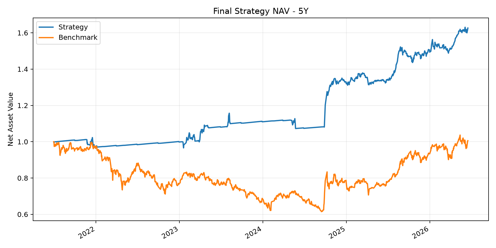
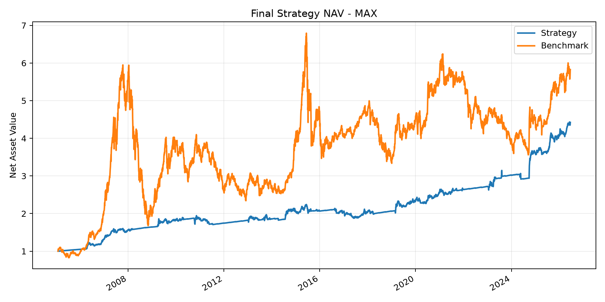
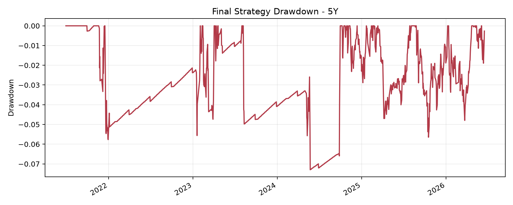
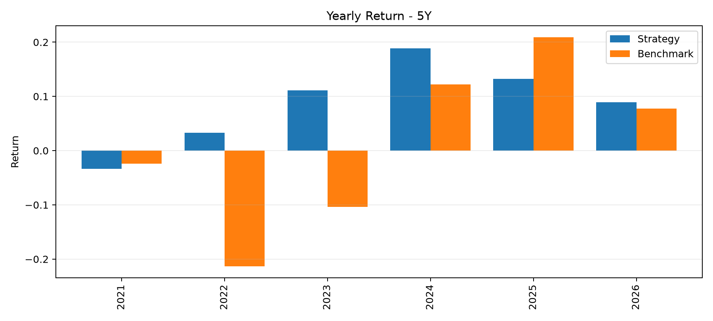
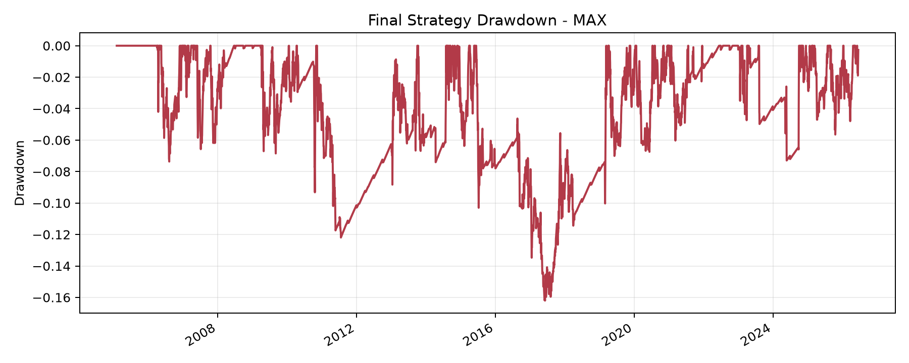
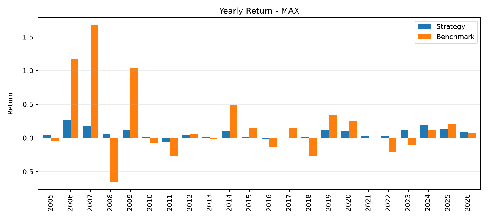

# A 股多因子量化交易系统课程报告

## 1. 项目摘要

本项目完成了一套可回测、可解释、可复现的 A 股多因子纯多头交易系统。系统由两部分构成：第一是股票排名算法，用于从可交易 A 股中筛选候选股票；第二是模拟交易规则，用于确定持仓数量、调仓频率、权重分配、交易成本和风险控制方式。

策略最终采用“趋势 + 突破 + 质量 + 风险控制”的多因子排名框架。组合每季度调仓，持有综合得分最高的 30 只股票，满足课程要求中“多头头寸至少包含 25 个具有一定流动性的持仓”的约束。回测同时覆盖最近 5 年和 Max 两个区间。

表 1 汇总了最终策略的核心回测结果。

| 区间 | 年化收益 | 累计收益 | 最大回撤 | Sharpe | Sortino | 年化换手率 | 最终净值 |
|---|---:|---:|---:|---:|---:|---:|---:|
| 最近 5 年 | 10.74% | 62.64% | -7.30% | 1.2014 | 1.3036 | 13.45 | 1.6264 |
| Max | 7.49% | 342.26% | -16.20% | 0.9206 | 0.9560 | 9.89 | 4.4226 |





## 2. 课程要求对应关系

课程作业要求小组设计一个可在米筐或 P123 平台实现的量化交易系统，完整系统应包括排名算法和模拟交易规则。作业同时要求使用标准化参数报告一组结果，并允许在说明理由的前提下放宽部分参数进行额外测试。

本项目对标准化参数的对应如下：

| 课程要求 | 本项目实现 |
|---|---|
| 多头头寸至少 25 个具有一定流动性的持仓 | 最终策略固定持有 30 只股票；最近 5 年和 Max 区间均没有低于 25 只的交易日 |
| 市值、价格、过去 20 日成交量过滤 | A 股环境下使用市值、收盘价和 20 日平均成交额过滤，并剔除停牌和 ST 股票 |
| 初始资金 100 万，考虑滑点和交易成本 | 回测采用 100 万初始资金口径，交易成本以比例成本计入净值 |
| 最近 5 年与 Max 回测 | 已完成两个区间回测并报告核心绩效指标 |
| 排名系统和模拟交易设置说明 | 报告第 4、5 节详细说明因子、权重、调仓和风控规则 |
| 参数微调敏感性 | 报告第 7 节展示调仓频率、目标波动率、均线长度等敏感性测试 |

由于课程参数以美股环境为背景，本项目在 A 股场景下保留其核心精神：价格、市值、流动性和持仓数量约束不变，但将市值和成交量指标转换为人民币市场下更合适的市值和成交额口径。同时，A 股特有的 ST、停牌和行业会计可比性问题也被纳入股票池过滤。

## 3. 数据来源与数据构成

数据来自米筐账号下载并整理的 A 股历史数据。数据覆盖股票日线行情、指数行情、交易日历、股票基础信息、ST 与停牌状态、财务与估值因子、复权信息、分红信息和无风险利率。策略仅使用已经整理好的静态数据进行研究回测，不在回测过程中动态请求在线行情或因子接口，从而保证回测结果可复现。

本项目使用的主要数据包括：

| 数据类型 | 用途 |
|---|---|
| 股票日线行情 | 计算价格、成交额、动量、均线、波动率、回撤和突破指标 |
| 指数日线行情 | 构建中证 800 基准和市场状态过滤 |
| 股票基础信息 | 判断上市时间、股票类型和行业 |
| ST / 停牌状态 | 剔除不可交易或风险状态异常股票 |
| 财务与估值因子 | 构建质量模块和市值过滤 |
| 无风险利率 | 对现金或低风险仓位进行收益估算 |

## 4. 排名系统设计

排名系统是本交易系统的核心。每个调仓日，策略先在可交易股票池中计算各股票的多因子得分，再按照综合分从高到低排序。最终买入排名靠前的股票。

### 4.1 趋势模块

趋势模块用于捕捉中期价格强势。A 股市场中，资金流入和趋势延续经常会在数月维度上持续，因此趋势信号可以帮助策略避免过早买入弱势股票。本项目使用 63 日、126 日和 252 日动量，以及 60 日、120 日均线相对强度构成趋势得分。

### 4.2 突破模块

突破模块用于识别价格接近阶段高点且成交活跃度改善的股票。具体信号包括接近 252 日高点程度，以及 20 日平均成交额相对 60 日平均成交额的变化。该模块的经济含义是：价格突破和成交活跃度提升共同出现时，往往代表市场关注度和资金参与度上升。

### 4.3 质量模块

质量模块用于约束组合基本面质量，避免策略完全依赖价格信号。使用的子因子包括 ROE、ROA、毛利率和经营现金流/债务。ROE 和 ROA 反映盈利能力，毛利率反映商业模式和产品竞争力，经营现金流/债务反映偿债能力和利润质量。

### 4.4 风险模块

风险模块用于降低组合暴露于高波动、高回撤股票的概率。使用的信号包括 120 日波动率、120 日下行波动率和 252 日回撤。波动率和下行波动率越低，风险得分越高；相对历史高点回撤越小，得分越高。

### 4.5 综合得分

所有子因子在调仓日横截面进行去极值和标准化处理，然后合成为模块得分。最终综合得分为：

```text
Score = 45% * Trend
      + 20% * Breakout
      + 20% * Quality
      + 15% * Risk
```

该权重设置体现了策略设计原则：以趋势和突破捕捉 A 股市场中的中期强势，以质量约束基本面风险，以风险模块降低高波动股票对组合的冲击。

## 5. 模拟交易设置

### 5.1 股票池过滤

每个调仓日从全 A 股开始筛选。股票必须满足普通股、非 ST、非停牌、上市满 273 个交易日、收盘价大于 2、20 日平均成交额达到流动性要求、市值达到筛选阈值等条件。金融行业被剔除，因为银行、券商、保险等公司的资产负债结构和财务指标含义与一般制造业、消费、科技公司差异较大。

### 5.2 持仓与调仓

策略每季度调仓，持有综合得分前 30 名股票。使用季度调仓而不是月度调仓，是因为趋势、质量和风险类信号的经济含义更适合中期持有，过高频率调仓会增加噪音交易和交易成本。

策略设置卖出缓冲：若原持仓股票没有跌出前 60 名，则继续持有。这可以减少排名小幅波动带来的频繁换仓。

### 5.3 权重与风险控制

组合采用逆波动率权重，使低波动股票获得相对更高权重，高波动股票获得相对更低权重。组合同时使用中证 800 指数 MA240 作为市场状态过滤。当市场处于长期均线下方时，策略降低股票风险暴露。组合目标波动率设为 8%，用于控制不同市场阶段下的整体风险。

对个股层面，若股票相对 252 日高点回撤超过 25%，策略不会立即强制清仓，而是在排名中施加惩罚。这样既能降低弱势股票入选概率，又能保证组合持仓数稳定。

## 6. 回测结果分析

### 6.1 最近 5 年结果

最近 5 年回测区间为 2021-06-30 至 2026-06-16。策略最终净值为 1.6264，年化收益 10.74%，最大回撤 -7.30%，Sharpe 1.2014。同期基准最终净值为 1.0057。该区间内，策略在收益和回撤控制上均明显优于基准。





### 6.2 Max 结果

Max 回测区间为 2005-01-31 至 2026-06-16。策略最终净值为 4.4226，年化收益 7.49%，最大回撤 -16.20%，Sharpe 0.9206。同期基准最终净值为 5.8247。长样本中，策略未跑赢基准最终净值，但显著降低了最大回撤和 Beta，体现出更强的防守属性。





### 6.3 持仓数量与交易成本

两个回测区间内，组合实际持仓数始终为 30 只，没有出现低于 25 只的情况。最近 5 年年化换手率为 13.45，Max 年化换手率为 9.89。交易成本已经计入净值，最近 5 年成本拖累为 9.63%，Max 成本拖累为 30.55%。这说明策略虽然取得了较好的回撤控制，但换手和交易成本仍是需要关注的限制因素。

## 7. 参数敏感性测试

课程评分标准要求关注参数微调对模型表现的影响。本项目重点测试了调仓频率、卖出缓冲、目标波动率和市场过滤均线长度。

表 2 展示了目标波动率测试的核心结论。较高目标波动率可以提升近 5 年收益，但会扩大 Max 回撤并降低长期 Sharpe。最终选择 8%目标波动率，是因为它在近 5 年 Sharpe 大于 1 的同时，对长样本回撤控制更好。

| 目标波动率 | 最近 5 年 Sharpe | 最近 5 年最大回撤 | Max Sharpe | Max 最大回撤 |
|---:|---:|---:|---:|---:|
| 8% | 1.2582 | -11.10% | 0.7651 | -16.17% |
| 10% | 1.2020 | -12.34% | 0.7078 | -20.57% |
| 12% | 1.1892 | -13.45% | 0.6566 | -24.48% |
| 16% | 1.1996 | -14.04% | 0.5656 | -32.73% |
| 20% | 1.2093 | -14.04% | 0.4917 | -41.35% |

表 3 展示了市场过滤均线长度测试。MA240 在 Max Sharpe 和最大回撤之间取得较好平衡，因此被保留为最终参数。

| 市场过滤 | 最近 5 年 Sharpe | 最近 5 年最大回撤 | Max Sharpe | Max 最大回撤 |
|---|---:|---:|---:|---:|
| MA120 | 1.3098 | -12.97% | 0.7371 | -25.13% |
| MA180 | 1.3592 | -10.04% | 0.6738 | -20.58% |
| MA200 | 1.2582 | -11.10% | 0.7651 | -16.17% |
| MA240 | 1.2014 | -7.30% | 0.9206 | -16.20% |
| MA300 | 1.3240 | -6.66% | 0.7883 | -14.49% |

卖出缓冲测试显示，将缓冲扩大到 90 名会使组合保留过多已经转弱的股票，降低收益质量，因此最终仍采用 60 名卖出缓冲。调仓频率测试显示，季度调仓比月度调仓更能降低交易噪音和成本，因此最终采用季度调仓。

## 8. 合理性、完整性、有效性与创造性

### 8.1 合理性

策略变量具有明确的事前理由。趋势和突破模块用于捕捉价格与成交活跃度改善，质量模块用于避免基本面较差的股票进入组合，风险模块用于降低波动和回撤。市场过滤和目标波动率并非事后任意调参，而是为了应对 A 股市场长周期波动和阶段性熊市风险。

### 8.2 完整性

本项目覆盖了完整交易系统所需的主要环节：数据准备、股票池过滤、排名系统、模拟交易规则、交易成本、最近 5 年和 Max 回测、敏感性测试、持仓分布、换手率、回撤分析和风险暴露诊断。报告中的图表和表格对应课程要求的提交成果。

### 8.3 有效性

最近 5 年回测中，策略取得 10.74% 年化收益、-7.30% 最大回撤和 1.2014 的 Sharpe，表现较好。Max 回测中，策略年化收益为 7.49%，最大回撤为 -16.20%，Sharpe 为 0.9206。虽然 Max 区间最终净值低于基准，但策略显著降低了回撤和 Beta，体现出较好的防守特征。

### 8.4 创造性

本策略在传统多因子框架上加入了趋势突破、低波风险预算、市场状态过滤和目标波动率控制。相比单纯基本面排序，策略更贴近 A 股市场中趋势和风险状态切换明显的特征。敏感性测试也展示了不同目标波动率和市场过滤窗口对收益、回撤和 Sharpe 的影响，体现了完整的策略迭代过程。

## 9. 局限性

本策略仍存在若干局限。第一，Max 区间 Sharpe 为 0.9206，未超过 1，说明长样本风险调整收益仍有提升空间。第二，市场过滤和目标波动率会降低牛市进攻性，因此在强牛市中可能跑输高 Beta 指数。第三，趋势和突破模块存在一定信息重叠，未来可以加入更独立的成长、盈利修正或分析师预期因子。第四，金融行业被整体剔除，未建立适用于银行、券商和保险的专门因子体系。第五，交易成本对长期净值仍有明显拖累，后续可以研究更低换手的调仓规则。

## 10. 结论

本项目按照课程要求完成了一套 A 股多因子量化交易系统。策略包含清晰的排名算法和模拟交易规则，满足至少 25 只流动性持仓、价格市值流动性过滤、最近 5 年与 Max 回测、交易成本计入和参数敏感性分析等要求。最终策略在最近 5 年取得较好的收益和风险控制，在 Max 区间也表现出较强的回撤控制能力。综合来看，该策略适合作为一套以稳健风险控制为目标的 A 股多因子交易系统。
